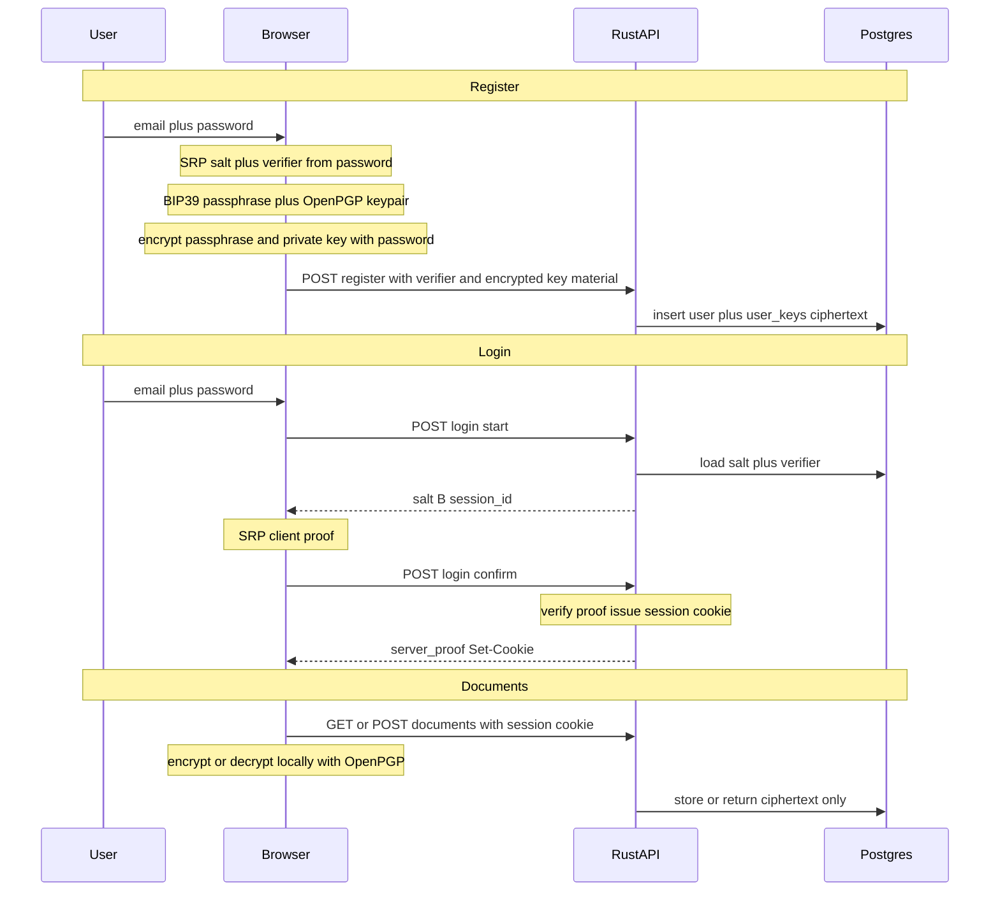

# Frontend — E2EE document app (TanStack Start)

> Work in progress.

TanStack Start SPA that talks to the **Rust API** in `../backend`. Sensitive data is handled in the browser: **SRP** for authentication (password never sent to the server) and **OpenPGP** for key material and document ciphertext.

## Security model

- **SRP-6a (SHA-256, 2048-bit group):** The server stores a **salt** and **verifier** only. Login proves knowledge of the password with **mutual proofs** (`client_proof` / `server_proof`); the password itself never leaves the client. This is a standard **PAKE** / **zero-knowledge-style password proof** — not zk-SNARKs.
- **E2EE:** A BIP39-style data passphrase and OpenPGP keypair are created in the browser. The passphrase is encrypted with the **account password** (OpenPGP symmetric) before upload; the private key is stored encrypted. The server keeps **ciphertext** and the **public key** only.
- **Documents:** Plaintext is encrypted with the user’s public key before `POST` or `PATCH`; the API persists **encrypted blobs** only. **Key rotation** uses `POST /api/me/keys/rotate` to replace keys and re-encrypted documents atomically (see Security in the app sidebar).

Optional **device passphrase wrap** (`src/lib/crypto/devicePassphraseWrap.ts`) stores an AES-GCM–wrapped mnemonic in `localStorage` so refresh can avoid re-entering the login password. Treat this as a UX tradeoff: XSS on your origin remains a practical risk for any secret in the browser.

## Tech stack

- **UI / routing / data:** TanStack Start, TanStack Router, TanStack Query
- **Build:** Vite 7
- **Crypto:** OpenPGP.js (ECC P-256), `@scure/bip39`, SRP registration + login math in `src/services/auth/adapters/srpRustLogin.ts` (aligned with the Rust `srp` crate, not generic RFC 5054 JS libraries)
- **Env:** `@t3-oss/env-core` — see [src/env.ts](src/env.ts)

## How it fits together



## Prerequisites

- Node.js 18+
- Running API and Postgres (easiest: from repo root, `../dev.sh`)

## Getting started

```bash
npm install
cp .env.example .env
```

Ensure `VITE_API_BASE_URL` matches the API origin (default `http://localhost:7000`, no trailing slash). It must align with `FRONTEND_ORIGIN` in the backend `.env` for credentialed CORS.

```bash
npm run dev
```

Or use the monorepo script (creates `.env` files if needed and starts Docker, API, and this app):

```bash
../dev.sh
```

## Environment variables

Defined in [src/env.ts](src/env.ts) and [`.env.example`](.env.example).

| Variable              | Description                                                        |
| --------------------- | ------------------------------------------------------------------ |
| `VITE_API_BASE_URL`   | Base URL of the Rust API (must be a valid URL, no trailing slash). |
| `VITE_MOCK_AUTH`      | Set to string `true` to use mock auth (development only).          |
| `VITE_MOCK_DOCUMENTS` | Set to string `true` to mock documents API.                        |
| `VITE_MOCK_USER_KEYS` | Set to string `true` to mock user keys API.                        |

## Scripts

| Script            | Description                                       |
| ----------------- | ------------------------------------------------- |
| `npm run start`   | Same as `dev` — Vite dev server on port **3666**. |
| `npm run dev`     | Vite dev server on port **3666**.                 |
| `npm run build`   | Production build.                                 |
| `npm run preview` | Preview production build.                         |
| `npm run test`    | Vitest.                                           |
| `npm run lint`    | ESLint.                                           |
| `npm run format`  | Prettier check.                                   |

## Project structure

- `src/routes/` — file-based routes (auth, document list/detail/create)
- `src/services/auth/` — barrel + types/mock; `adapters/` (HTTP/SRP), `hooks/` (TanStack Query)
- `src/services/encryption/` — TanStack Query hooks around keys and document crypto
- `src/lib/crypto/` — OpenPGP key lifecycle, recovery phrase hashing, optional device wrap (`index.ts` re-exports)
- `src/lib/http/apiClient.ts` — fetch wrapper toward `VITE_API_BASE_URL`
- `src/lib/utils/` — shared UI helpers (e.g. `cn`)
- `src/lib/async/` — small async utilities (e.g. `waitFor`)

## i18n

Paraglide: messages under `project.inlang/messages`; localized URLs via the Paraglide Vite plugin and router hooks.

## More detail

- Backend API and data model: [../backend/README.md](../backend/README.md)
- Monorepo dev entrypoint: [../README.md](../README.md)
